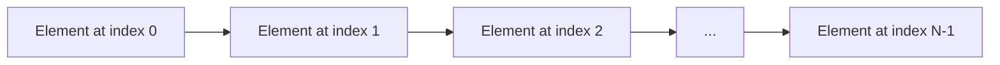

[](https://classroom.github.com/open-in-codespaces?assignment_repo_id=21698776)

# Java Arrays Lab

## Table of Contents

1. [Introduction](#introduction)
2. [Default Values in Arrays](#default-values-in-arrays)
3. [Different Ways of Declaring and Assigning an Array](#different-ways-of-declaring-and-assigning-an-array)
4. [Accessing and Iterating Over Array Elements](#accessing-and-iterating-over-array-elements)
5. [Array Length](#array-length)
6. [Modifying Arrays](#modifying-arrays)
7. [Arrays of Objects](#arrays-of-objects)
8. [Common Array Operations](#common-array-operations)
9. [The Arrays Utility Class](#the-arrays-utility-class)
10. [Cloning Arrays](#cloning-arrays)
11. [2D Arrays](#2d-arrays)
12. [Passing Arrays to Methods](#passing-arrays-to-methods)
13. [Summary](#summary)


## Introduction

In Java, an array is a collection of variables of the same type, stored in a contiguous block of memory. Arrays allow you to store multiple values in a single variable, which can be accessed using an index. Understanding arrays is fundamental in programming as they provide a way to manage and manipulate data efficiently.

### Key Concepts

- **Fixed Size**: Once an array is created, its size cannot be changed.
- **Zero-Based Indexing**: Array indexing starts at 0.
- **Homogeneous Elements**: All elements in an array are of the same data type.

#### Array Structure



Before you begin the below exercises, create a java package called `ie.atu.arrays` to store all your code in. Use the Java Projects file explorer to create the package.  

## Default Values in Arrays

Before we delve deeper into arrays, it's important to understand the default values assigned to array elements when they are not explicitly initialized.

- **Numeric Types**: Default to `0`.
- **`char`**: Defaults to `'\u0000'` (the null character).
- **`boolean`**: Defaults to `false`.
- **Reference Types**: Defaults to `null`.

### Code Example

```java
public class DefaultValues {
    public static void main(String[] args) {
        int[] intArray = new int[3];
        boolean[] boolArray = new boolean[3];
        String[] stringArray = new String[3];

        System.out.println("Default int values:");
        for (int num : intArray) {
            System.out.print(num + " ");
        }

        System.out.println("\nDefault boolean values:");
        for (boolean bool : boolArray) {
            System.out.print(bool + " ");
        }

        System.out.println("\nDefault String values:");
        for (String str : stringArray) {
            System.out.print(str + " ");
        }
    }
}
```

<details>
<summary>Output</summary>

```
Default int values:
0 0 0 
Default boolean values:
false false false 
Default String values:
null null null 
```

</details>

### DIY Exercise

- **Task**: Declare an array of `char` with a size of 4 and print out the default values.
- **Hint**: Do not initialize the array elements; simply print them using a loop.


## Different Ways of Declaring and Assigning an Array

There are several ways to declare and initialize arrays in Java.

### Declaration Without Initialization

```java
int[] numbers; // Declares an array of integers
```

### Declaration With Initialization

```java
int[] numbers = new int[5]; // Declares an array and allocates memory for 5 integers
```

### Inline Initialization

```java
int[] numbers = {1, 2, 3, 4, 5}; // Declares and initializes the array with values
```

### Using the `new` Keyword with Initialization

```java
int[] numbers = new int[]{1, 2, 3, 4, 5};
```

### Code Example
```java
public class ArrayDeclaration {
    public static void main(String[] args) {
        // Method 1: Declaration without initialization
        int[] array1;
        array1 = new int[3]; // Now initialized with default values (0, 0, 0)

        // Method 2: Declaration with size
        int[] array2 = new int[3]; // Initialized with default values

        // Method 3: Inline initialization
        int[] array3 = {1, 2, 3};

        // Method 4: Using new keyword with initialization
        int[] array4 = new int[]{4, 5, 6};

        // Displaying array elements
        for (int num : array3) {
            System.out.print(num + " ");
        }
    }
}
```

<details>
<summary>Output</summary>

```
1 2 3 
```

</details>

### DIY Exercise

- **Task**: Declare an array of `double` with the values `1.5`, `2.5`, `3.5`, `4.5`.
- **Hint**: Use inline initialization similar to the examples above.


## Accessing and Iterating Over Array Elements

After declaring and initializing an array, you can access its elements using indices and iterate over them using loops.

### Accessing Elements by Index

```java
int[] numbers = {10, 20, 30, 40, 50};
int firstNumber = numbers[0]; // Accessing the first element
System.out.println("First number: " + firstNumber);
```

### Iterating Using Loops

#### Using a Traditional `for` Loop

```java
for (int i = 0; i < numbers.length; i++) {
    System.out.println("Element at index " + i + ": " + numbers[i]);
}
```

#### Using an Enhanced `for` Loop (For-Each Loop)

The enhanced `for` loop (also called a for-each loop) provides a simpler way to iterate over arrays. It automatically handles the indexing for you.

```java
for (int num : numbers) {
    System.out.println(num);
}
```

### Code Example

```java
public class ArrayIteration {
    public static void main(String[] args) {
        int[] numbers = {5, 10, 15, 20};

        // Accessing elements by index
        System.out.println("First element: " + numbers[0]);
        System.out.println("Last element: " + numbers[numbers.length - 1]);

        // Iterating using traditional for loop
        System.out.println("Using traditional for loop:");
        for (int i = 0; i < numbers.length; i++) {
            System.out.println("Element at index " + i + ": " + numbers[i]);
        }

        // Iterating using enhanced for loop
        System.out.println("Using enhanced for loop:");
        for (int num : numbers) {
            System.out.println(num);
        }
    }
}
```

<details>
<summary>Output</summary>

```
First element: 5
Last element: 20
Using traditional for loop:
Element at index 0: 5
Element at index 1: 10
Element at index 2: 15
Element at index 3: 20
Using enhanced for loop:
5
10
15
20
```

</details>


### DIY Exercise

- **Task**: Write a program to print all elements of an array in reverse order.
- **Hint**: Use a `for` loop starting from the last index.


## Array Length

The length of an array refers to the number of elements it can hold. In Java, you can access the length using the `.length` property.

### Code Example

```java
public class ArrayLength {
    public static void main(String[] args) {
        int[] numbers = {10, 20, 30, 40, 50};
        System.out.println("The length of the array is: " + numbers.length);
    }
}
```

<details>
<summary>Output</summary>

```
The length of the array is: 5
```

</details>

### DIY Exercise

- **Task**: Write a program that calculates and prints the length of a string array that contains the colors of the rainbow.
- **Hint**: Create an array and use the `.length` property to get its size.


## Modifying Arrays

You can modify array elements by accessing them via their index and assigning new values.


### Code Example

```java
public class ModifyArray {
    public static void main(String[] args) {
        String[] fruits = {"Apple", "Banana", "Cherry"};
        fruits[1] = "Blueberry"; // Modifies the second element

        // Displaying modified array
        for (String fruit : fruits) {
            System.out.print(fruit + " ");
        }
    }
}
```

<details>
<summary>Output</summary>

```
Apple Blueberry Cherry 
```

</details>

### DIY Exercise

- **Task**: Given an array `int[] nums = {10, 20, 30, 40}`, change the third element to `35` and print the array.
- **Hint**: Access the element at index 2 and assign a new value.


## Arrays of Objects

Arrays in Java can store objects, not just primitive data types. Below we have a Student class. In the ArrayOfObjects class we will create a students array which will hold Student objects.

### Code Example

```java
class Student {
    private String name;
    private int age;

    // Constructor
    Student(String name, int age) {
        this.name = name;
        this.age = age;
    }

    // Getter methods
    String getName() {
        return name;
    }

    int getAge() {
        return age;
    }
}
```
```java
public class ArrayOfObjects {
    public static void main(String[] args) {
        // Array of Strings (which are objects in Java)
        String[] names = {"Alice", "Bob", "Charlie"};

        // Array of custom objects
        Student[] students = new Student[2];

        students[0] = new Student("Dave", 20);
        students[1] = new Student("Eva", 22);

        for (Student student : students) {
            System.out.println(student.getName() + " is " + student.getAge() + " years old.");
        }
    }
}
```

<details>
<summary>Output</summary>

```
Dave is 20 years old.
Eva is 22 years old.
```

</details>

### DIY Exercise

- **Task**: Create an array of `Book` objects, initialize their titles and authors, and print out their details.
- **Hint**: Define a `Book` class with appropriate attributes and methods.


## Common Array Operations


### Copying Arrays

You can copy arrays using methods like `System.arraycopy()`.

```java
public class CopyArray {
    public static void main(String[] args) {
        int[] original = {1, 2, 3};
        int[] copy = new int[original.length];

        System.arraycopy(original, 0, copy, 0, original.length);

        // Modify the copy
        copy[0] = 10;

        // Display both arrays
        System.out.println("Original array: " + java.util.Arrays.toString(original));
        System.out.println("Copied array: " + java.util.Arrays.toString(copy));
    }
}
```

<details>
<summary>Output</summary>

```
Original array: [1, 2, 3]
Copied array: [10, 2, 3]
```

</details>

### Sorting Arrays

You can sort arrays using `Arrays.sort()`.

```java
import java.util.Arrays;

public class SortArray {
    public static void main(String[] args) {
        int[] numbers = {5, 3, 2, 4, 1};
        Arrays.sort(numbers);
        System.out.println("Sorted array: " + Arrays.toString(numbers));
    }
}
```

<details>
<summary>Output</summary>

```
Sorted array: [1, 2, 3, 4, 5]
```
</details>

### DIY Exercise

- **Task**: Write a program that copies an array and sorts it without altering the original array.
- **Hint**: Use `System.arraycopy` and `Arrays.sort`.


## The Arrays Utility Class

The `java.util.Arrays` class provides utility methods for array manipulation.

### Converting Arrays to Strings

```java
import java.util.Arrays;

public class ArraysToString {
    public static void main(String[] args) {
        String[] fruits = {"Apple", "Banana", "Cherry"};
        System.out.println(Arrays.toString(fruits));
    }
}
```

<details>
<summary>Output</summary>

```
[Apple, Banana, Cherry]
```

</details>

### Searching Arrays

```java
import java.util.Arrays;

public class ArraySearch {
    public static void main(String[] args) {
        int[] numbers = {1, 2, 3, 4, 5};
        int index = Arrays.binarySearch(numbers, 3);
        System.out.println("Index of 3: " + index);
    }
}
```

<details>
<summary>Output</summary>

```
Index of 3: 2
```

</details>

### DIY Exercise

- **Task**: Use the `Arrays` class to compare two arrays for equality.
- **Hint**: Use `Arrays.equals(array1, array2)`.


## Cloning Arrays

You can create a copy of an array using the `clone()` method.

### Code Example

```java
public class CloneArray {
    public static void main(String[] args) {
        int[] original = {1, 2, 3};
        int[] clone = original.clone();

        // Modify the clone
        clone[0] = 10;

        // Display both arrays
        System.out.println("Original array: " + java.util.Arrays.toString(original));
        System.out.println("Cloned array: " + java.util.Arrays.toString(clone));
    }
}
```

<details>
<summary>Output</summary>

```
Original array: [1, 2, 3]
Cloned array: [10, 2, 3]
```

</details>

### DIY Exercise

- **Task**: Clone an array of strings and modify the clone without affecting the original array.
- **Hint**: Verify the independence of the arrays after modification.


## 2D Arrays

A 2D array is an array of arrays, useful for representing grids or tables.

### Declaration and Initialization

```java
int[][] matrix = new int[3][3]; // 3x3 matrix with default values

int[][] predefinedMatrix = {
    {1, 2, 3},
    {4, 5, 6},
    {7, 8, 9}
};
```

### Code Example

```java
public class TwoDArray {
    public static void main(String[] args) {
        int[][] matrix = {
            {1, 2, 3}, // Row 0
            {4, 5, 6}, // Row 1
            {7, 8, 9}  // Row 2
        };

        // Accessing element at row 1, column 2
        System.out.println("Element at (1,2): " + matrix[1][2]);

        // Modifying element at row 0, column 0
        matrix[0][0] = 10;

        // Displaying the 2D array
        for (int i = 0; i < matrix.length; i++) { // Rows
            for (int j = 0; j < matrix[i].length; j++) { // Columns
                System.out.print(matrix[i][j] + " ");
            }
            System.out.println();
        }
    }
}
```

<details>
<summary>Output</summary>

```
Element at (1,2): 6
10 2 3 
4 5 6 
7 8 9 
```

</details>

### DIY Exercise

- **Task**: Create a 2D array representing the following table and print the sum of all elements.

```
1 2 3
4 5 6
7 8 9
```

- **Hint**: Use nested loops to traverse the 2D array and accumulate the sum.


## Passing Arrays to Methods

Arrays can be passed to methods as parameters, and methods can return arrays.

### Code Example

```java
public class ArrayMethods {
    public static void main(String[] args) {
        int[] numbers = {1, 2, 3};
        printArray(numbers);

        int[] squaredNumbers = squareArray(numbers);
        System.out.println("Squared array: " + java.util.Arrays.toString(squaredNumbers));
    }

    // Method to print array elements
    public static void printArray(int[] array) {
        for (int num : array) {
            System.out.print(num + " ");
        }
        System.out.println();
    }

    // Method to return a new array with squared elements
    public static int[] squareArray(int[] array) {
        int[] result = new int[array.length];
        for (int i = 0; i < array.length; i++) {
            result[i] = array[i] * array[i];
        }
        return result;
    }
}
```

<details>
<summary>Output</summary>

```
1 2 3 
Squared array: [1, 4, 9]
```

</details>

### DIY Exercise

- **Task**: Write a method that takes an array of integers and returns a new array with each element doubled.
- **Hint**: Iterate over the input array, double each element, and store it in a new array.


## Summary

In this lab, we've covered:

- Various methods to declare and initialize arrays.
- Default values assigned to array elements.
- Accessing and iterating over array elements using traditional and enhanced for loops.  
- Utilizing the array's length.
- Modifying elements within an array.
- Arrays of objects and how to work with them.
- Common array operations like copying, sorting, and searching.
- Utilizing the `Arrays` utility class for array manipulation.
- Cloning arrays to create independent copies.
- Understanding and working with 2D arrays.
- Passing arrays to methods.

Arrays are a foundational aspect of Java programming, enabling efficient data storage and manipulation. Mastery of arrays will significantly aid in understanding more complex data structures and algorithms. By exploring these additional topics, you've equipped yourself with a robust understanding of arrays in Java.

```
